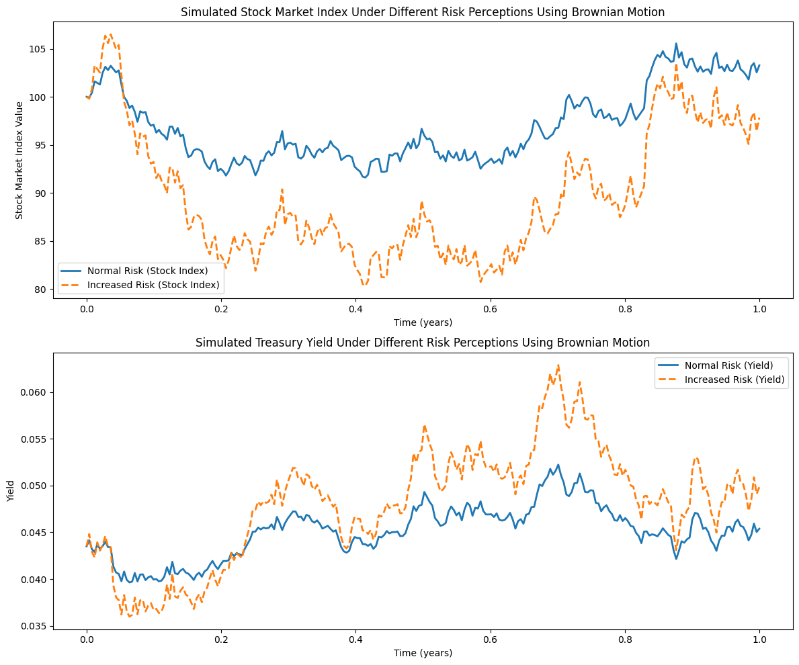

### Modelling Geopolitcal Risk's Impact on US's economy for AP Economics

Risk Premium and Investment: The risk premium is the return over and above the risk-free rate that investors demand for holding a risky asset. If the U.S. were perceived as a riskier place to invest, the risk premium on U.S. assets would rise, including government bonds. That would raise the cost of borrowing for the U.S. government and American businesses, and it would deter investment because of higher interest rates. AP Economics students assess how investment may be affected by perceptions of risk and rates of interest, and this carries implications for economic growth. 

Stock Market and Household Wealth: "The more the perception of the U.S. as a riskier economy increases, the household wealth may decline owing to the decline in the stock market". It is seen as the wealth effect in the study of macroeconomics, wherein changes in the wealth of a consumer determine the spending and saving behavior of the consumers. A huge fall in the stock market will make the consumer spending lower, thereby slowing the cycle of economic growth.

International Capital Flows: A higher perceived risk in the U.S. might push investors to shift their capital into less risky countries such as Canada, Germany, or Japan. The AP Economics course of study in capital flows and the impact of cross-border mobility of capital also comes into play here. A shift in capital inflows or outflows can lead to exchange rate changes, which then affect the balance of payments and economic stability of a country.

Government Fiscal Health and Default Risk: The implications of potential U.S. government actions, such as near defaults or large budget deficits, are highly relevant topics of discussion. AP Economics covers the fiscal policy of government, including what budget deficits imply for national debt and interest rates. With higher default risks, interest rates may rise as lenders demand higher returns for assuming a greater risk, thereby crowding out private investments.

Economic Growth and Living Standards: The article goes further to look at the larger implications for economic growth and standards of living. AP Economics explores how economic policies really determine growth and standards of living. For instance, higher interest rates, due to risk premiums, probably dampen investment, lower growth, and in turn hurt employment and income levels.

Visual Illustrations:

- Loanable Funds Market: Explains how higher risk premiums increase interest rates and make investments scarce.
- AD-AS Model: It shows the fluctuations of economic output and price level, given the shift in aggregate demand and supply caused by changes in investment and consumption.
- International Capital Flow Model: This explains how changes in investment desirability alter capital flows and correspondingly exchange rates.

These visuals make theoretical assumptions clear by mapping out how savings, investments, and the greater economy are all interlinked-influenced by market sentiment and external risks.

Overview of the AD-AS Model:

The Aggregate Demand-Aggregate Supply (AD-AS) model illustrates the levels of total output and price levels in an economy. Its key components include:

- **Horizontal Axis:** Real GDP or output.
- **Vertical axis**: Price levels measured or an index of price level derived either from a GDP-deflator or consumer price index measurement.
- **Curves**:
  - **Aggregate Demand (AD):** Downward sloping because the lower price level increases the real value of money, leading to increased consumption and investment.
  - **SRAS End -Short-run Aggregate Supply**: Upward sloping-higher price and vice-versa motivate the producer.
  - **Long-run Aggregate Supply (LRAS)** shows a vertical line at potential output. It gives the highest production level an economy can achieve in the long run, which can be sustained.

Increased Risk Impact:

Increased perceived risk primarily affects the AD curve, shifting it to the left. This is so due to reduced consumer and business spending from increased borrowing cost and reduced wealth.

Loanable Funds Market:

This model shows how supply and demand for loanable funds interact:

- **Horizontal Axis:** Quantity of loanable funds (in dollars).
- **Vertical Axis:** Real interest rate, in percent.
- **Curves**:
  - **Demand Curve for Loanable Funds:** Downward sloping because a fall in interest rates encourages borrowing.
  - **Supply Curve of Loanable Funds:** In a positive slope because high rates of interest will result in more saving.

A change in the perception of U.S. risk shifts the demand curve leftward, which serves to increase interest rates and decrease funds available for investment. This, in turn, slows economic growth.

Capital Flow Model:

- **Initial Condition:** Stable economies attract international capital due to low risks. U.S. securities have traditionally been in demand.
- **After Risk Increase**:
  - **Capital Outflows:** A search for safer alternative homes, therefore, reduces U.S. capital inflows.
  - **Interest Rates:** A high increase in the rates shows that the returns are greater to compensate for the risk aversion of investors.
  - **Exchange Rates:** The result of weakened demand for US assets is a weaker dollar. With this fact in place, the export of products should be cheaper, and conversely, the imports more expensive.

This translates graphically into smaller inflows and larger outflows and, importantly, an overall switch from net inflow to net outflow; this latter point brings in sharp relief the question of the confidence of investors.

Link to Advanced Models:

Stochastic Differential Equations:

These equations model systems that are under the influence of both deterministic and random factors; their application in finance is immense for the assessment of variables like stock prices and interest rates. Simulations indicate increased volatility and higher yields under riskier U.S. conditions, which also accord with the discussion of investor behavior and economic implications in the article.

Connections to AP Economics: 
- **Loanable Funds Market:** Increased risk shifts the demand for funds leftward and pushes interest rates up. 
- **AD-AS Analysis:** Higher risk decreases aggregate demand, which decreases output while increasing prices. 
- **International Capital Flows:** Risk-induced change in capital mobility feeds back into the determination of exchange rates and trade balance.
